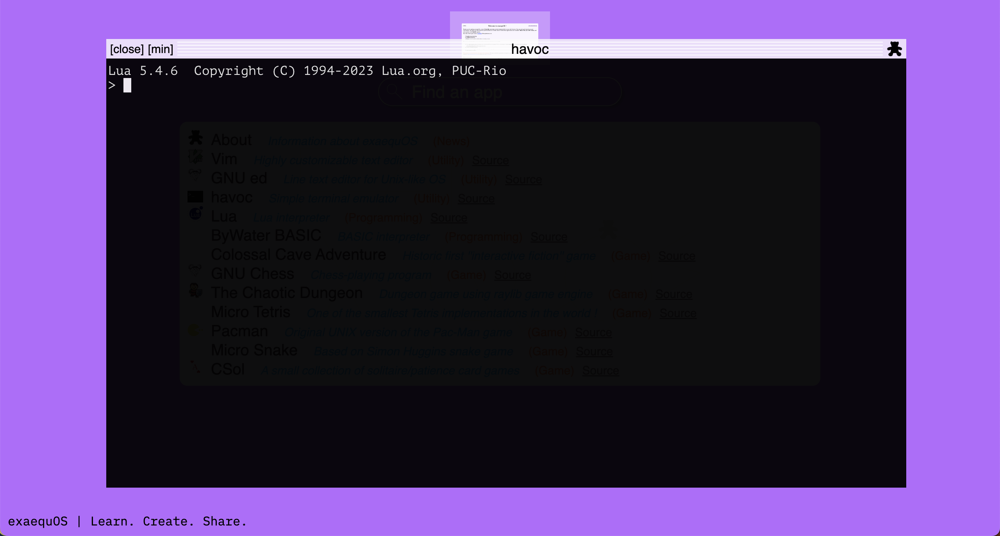
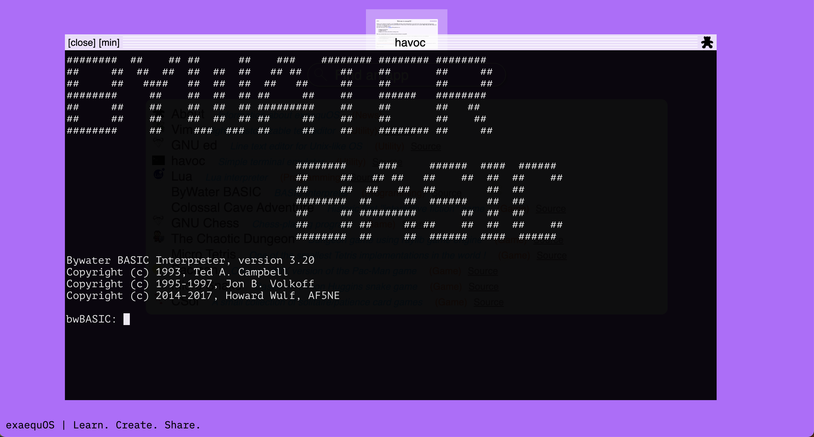
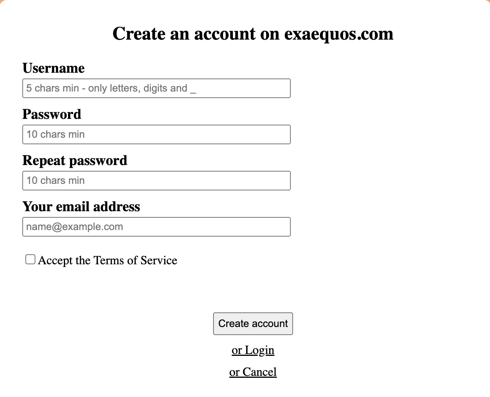
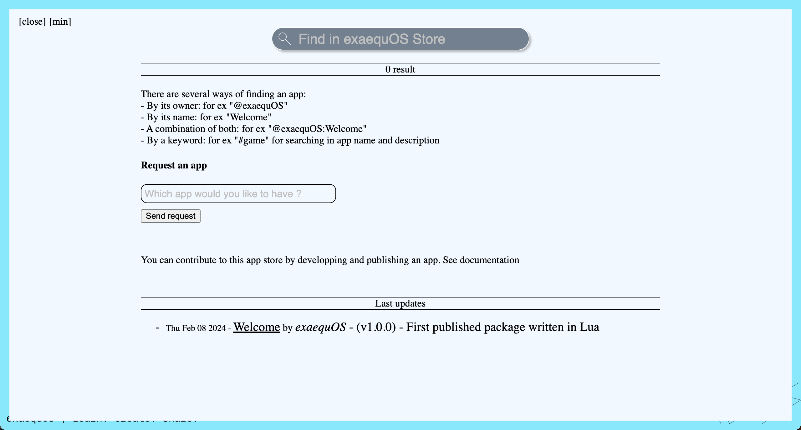

Developer's guide
=================

There are two options for creating a program running in exaequOS:
 1. Using an interpreter inside exaequOS (lua, bwbasic and more to come)
 2. Developping a C/C++ program on the host machine using the emscripten-exa toolchain.

The objective is to embed the emscripten-exa toolchain directly in exaequoOS.

Supported languages
-------------------

C/C++
^^^^^
Programs written in C/C++ are compiled on your hoost machine with emscripten-exa toolchain, a modified version of emscripten (see below), in order to generate WebAssembly binaries (and some Javascript). These are the fastest programs that can be run in exaequOS. They can be pure console programs or using frame buffer or using Wayland protocol (buffer mode or OpenGL ES 3 mode).

For using OpenGL ES 3 (i.e WebGL 2), the user can be helped by GLFW3 library or Raylib.

Lua
^^^
Lua interpreter is installed in exaequOS and can either interpret lua files (edited by vim or ed) or can interpret user commands on the fly (CLI, command-line interface).

BASIC
^^^^^
User can also create BASIC programs that can be interpreted by bwbasic. In a same way as Lua, bwbasic can either interpret basic files or user commands with the CLI.

emscripten-exa toolchain
------------------------

The emscripten-exa toolchain is accessible on `GitHub <https://github.com/baudaux/emscripten-exa>`_.

Installation
^^^^^^^^^^^^
Using git, you can clone the repository into your host machine. In order to use emcc or em++ compiler commands, you also need to install python3, nodejs, clang/llvm toolchain, binaryen, cmake. You can check the content of the Dockerfile for the full list of dependencies (see below).

Dockerfile
^^^^^^^^^^

The Dockerfile is accessible on `GitHub <https://github.com/baudaux/docker-exa>`_. It allows you to directly create a docker image on your host machine and to compile your apps in this docker.

Running the compiled application
--------------------------------
emscripten-exa toolchain will generate (in your host machine) two files: <app name>.js and <app name>.wasm. There shall be accessible to exaequOS.

Local HTTP server
^^^^^^^^^^^^^^^^^
An HTTP server (port 7777) shall run in your host machine in order to serve the application files (exa.html, <app name>.js and <app name>.wasm). Here is an example of file tree that allows exaequOS to find and execute your application:

::

   root server directory
   └── media
       └── localhost
           └── <app name>          
               └── exa
                   ├── exa.html          
                   ├── <app name>.js
                   └── <app name>.wasm
   
exa.html file shall look like::

  <!doctype html>
  <html lang="en-us">
  <head>
    <meta charset="utf-8">
    <meta http-equiv="Content-Type" content="text/html; charset=utf-8">
    <title>Emscripten-Generated Code</title>

    
  </head>

  <body>

    
  </body>
  
  </html>

You need to replace "havoc.js" by the generated js file name.
  
/media/localhost
^^^^^^^^^^^^^^^^
In order to execute the application, you need to open a terminal window and type (after $)::

  exaequos:~ $ /media/localhost/<app name>

Publishing to the store
-----------------------

Register and connect to exaequos.com
^^^^^^^^^^^^^^^^^^^^^^^^^^^^^^^^^^^^

In order to publish an app on the store, you need to first signup and connect to the platform.

exapkg
^^^^^^

Once connected, you have to change the current working directory to the app directory (/media/localhost/<app name> or /home/<app path>) and to start the command 'exapkg'::

  exaequos:~ $ cd /media/localhost/<app name>
  exaequos:/media/localhost/<app name> $ exapkg
  
The following window appears. You have to fill it and click on create. The app is then published on the store.

.. image:: exapkg.png
  :width: 800
  :alt: exapkg

exaequOS store
^^^^^^^^^^^^^^

The published app will be found in the following directory::
  
  /usr/store/<user name>/<package name>

And will be found on hte store: 

Link to your app
^^^^^^^^^^^^^^^^

You can then provide to others a direct link to your app::

  https://exaequos.com/?a=@<user_name>/<package_name>

or, more generally::
  
  https://exaequos.com/?a=/usr/store/<user_name>/<package_name>

