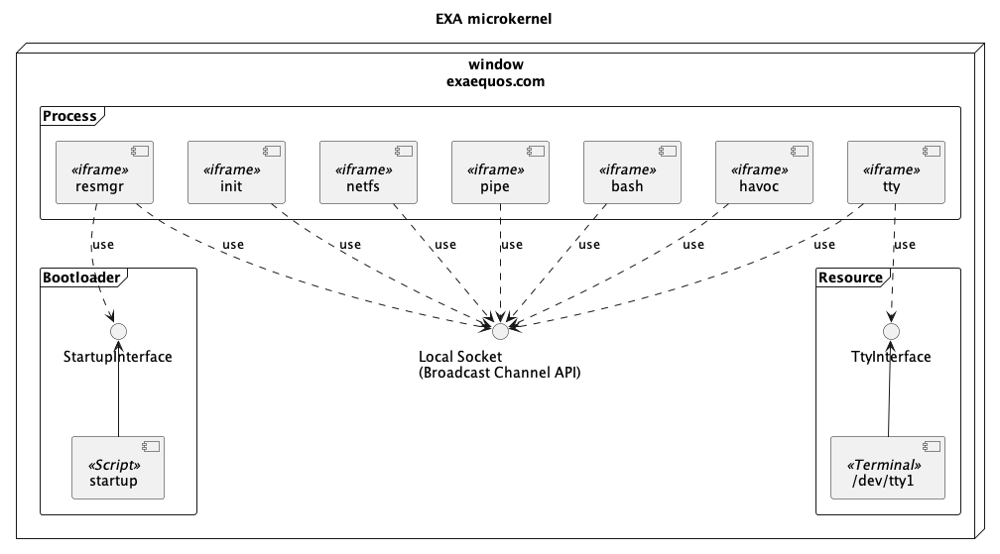

EXA kernel
==========

EXA kernel is a brand new Unix-like kernel specifically designed for running in a Web browser. EXA kernel is open-source (GPL v3) and can be found on `GitHub <https://github.com/baudaux/exa-kernel>`_.

Microkernel architecture
------------------------

I thought (and still think) that a microkernel architecture was well suited for this kind of operating system, every driver being a process. Every process runs in its own iframe.

	
Startup sequence
----------------
EXA kernel is started in the following order:
 1. Initial script starts the resource manager (resmgr),
 2. resmgr starts tty driver
 3. resmgr starts netfs driver
 4. resmgr starts pipe driver
 5. resmgr start init process (system V init)
 6. init reads the /etc/inittab file and starts the processes as specified in this file
 7. init starts localfs process
 8. init starts oxygen desktop process

Processes
---------
Here is a overview of the main processes part of the kernel:

 * resmgr: resource manager implementing process management, driver/device management and virtual file system (vfs)
 * tty: driver responsible for sending characters to (pseudo-)terminal and receiving characters from it
 * netfs: driver responsible for getting files from the server (or localhost) and mounting the remote files hierarchy on /bin, /usr/, /etc
 * init: System V init process responsible for starting the (not yet started) processes
 * localfs: driver responsible for reading/writing files on the local persistent browser IndexedDB storage. It is mounted on /home
 * pipe: driver responsible for implementing the pipe mechanism of the OS

These processes are written in C and compiled in WebAssembly with the emscripten-exa toolchain.

Interprocess communication (IPC)
--------------------------------
Iframes exchange commands and data through BroadcastChannel Web API that is seen as a local socket (datagram mode).

Musl libc
---------

emscripten toolchain uses musl libc. So every process is linked with musl. syscalls implementation have been addapted for communicating with resmgr and drivers.

