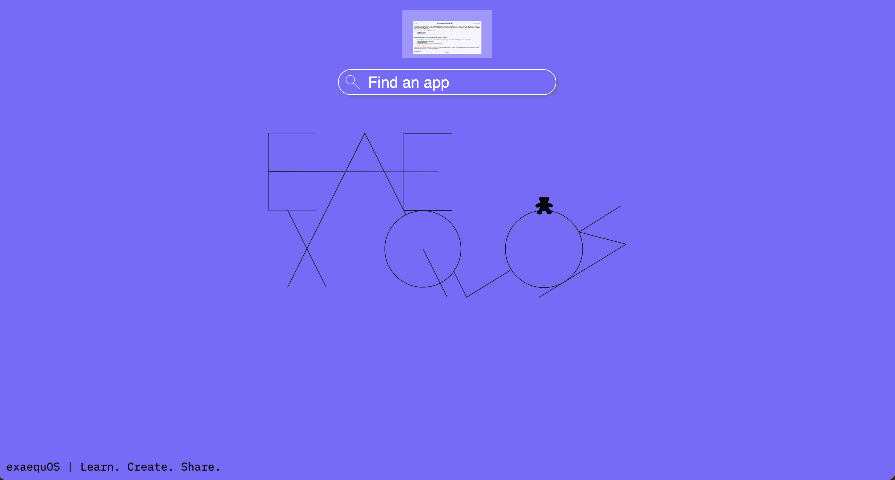
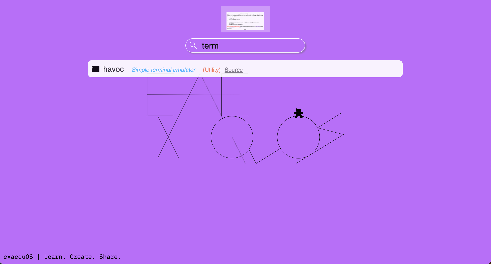
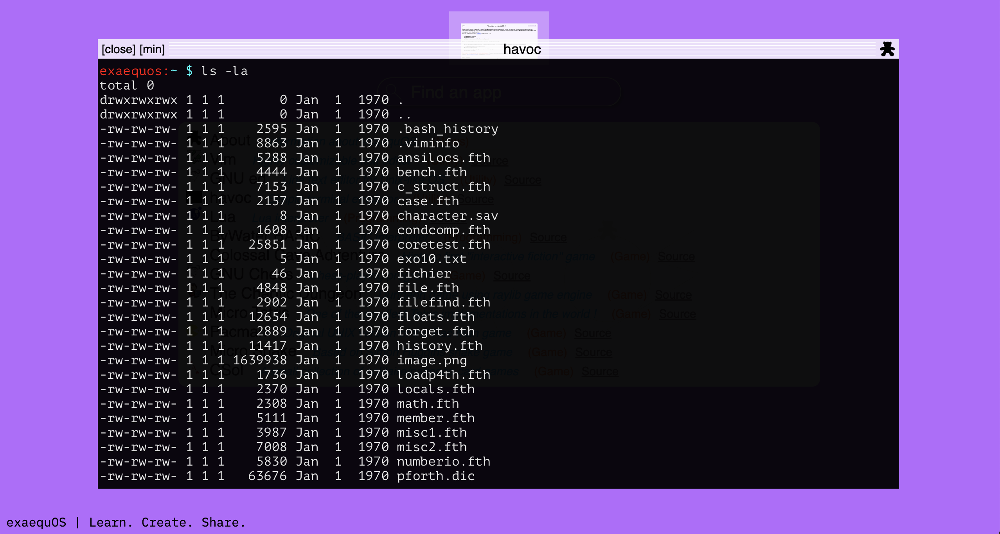

Start guide
===========

Desktop environment
-------------------

Here is a capture of the Oxygen desktop environment.

 
It allows to :
 * Search an application
 * Execute an application
 * Close/minimize/maximize an application
 * Minimize all applications
 
Application search
------------------
Search input allows to search among the apps in the database of declared apps and published (not yet) apps. Not all binaries in netfs (/bin, /usr/bin, /usr/games, etc…) are searched. The user can then start the found application from the result list.

	
Havoc terminal
--------------
Another way of starting applications is to first start the havoc terminal and to enter the application path in the bash command line (for ex /usr/games/gnuchess or /usr/bin/vim or vim).

	
 
Close/minimize/maximize an application
--------------------------------------
Using the app window decoration, the user can close or minimize the associated window. The minimized windows appear on top of the search input.
 
Minimize all applications
-------------------------
Using the “Axel” (teddy bear) icon on the right of each window decoration, the user can minimize all windows at once.
 
Autoexec app
-------------
It is possible to define an autostart application by specifying it in the url thanks to the “a” parameter.
For example::
  https://exaequos.com/?a=/usr/bin/vim

  
